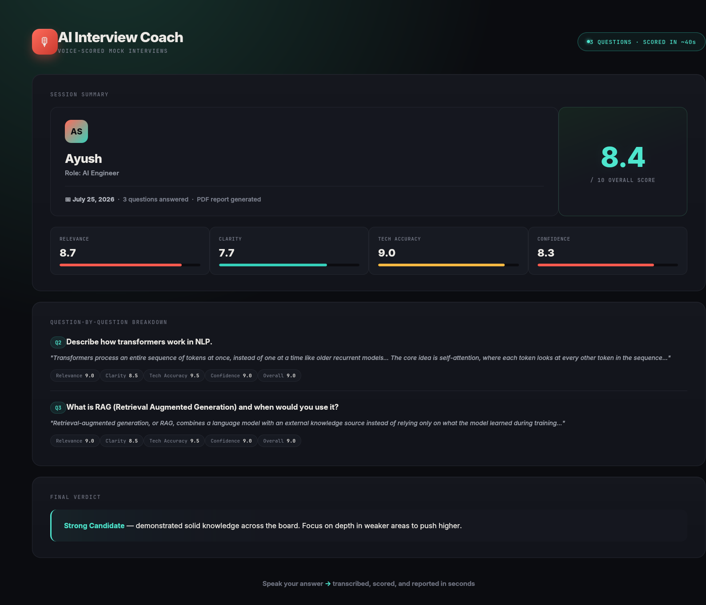

# 🎙️ AI Interview Coach


[](https://github.com/ayush-s-tomar/ai-interview-coach/actions/workflows/ci.yml)


> Real-time voice interview simulator that scores answers on relevance, clarity, technical accuracy, and confidence — then generates a personalized PDF feedback report.

🔗 **[Live Demo](https://mockinterview-ai.streamlit.app/)**



---

## 📚 Contents

[Why I Built This](#-why-i-built-this) · [Features](#-features) · [Architecture](#️-architecture) · [Tech Stack](#️-tech-stack) · [How It Works](#-how-it-works) · [Run Locally](#-run-locally) · [Env Vars](#-environment-variables) · [Structure](#-project-structure) · [Roadmap](#️-planned-improvements)

---

## 💡 Why I Built This

Every fresher faces the same problem — you can grind DSA and system design, but nobody tells you how your actual spoken answers land in a real interview. I built this while prepping for my own interviews. It's the tool I wished existed: record an answer, get scored like a real interviewer would, and see exactly where you lose points.

---

## ✨ Features

- 🎯 **Role-based questions** — SDE, AI Engineer, Data Analyst
- 🎤 **Voice recording** — answer verbally, right in the browser (or upload audio)
- 🤖 **AI scoring** — Groq (LLaMA 3.3 70B) evaluates across 4 dimensions: Relevance · Clarity · Technical Accuracy · Confidence
- 📄 **PDF report** — per-question breakdown with concrete improvement tips
- ⚡ **Fast transcription** — Faster-Whisper, with automatic fallback to a lighter model under memory pressure
- 🔒 **Privacy-first** — no audio stored; transcription happens in-memory

---

## 🏗️ Architecture

Single-file Streamlit app — no separate backend, no database. Audio is captured client-side, transcribed in-memory via Faster-Whisper, scored by a single Groq LLM call, and rendered straight into a downloadable PDF. Nothing about a candidate's answers ever touches disk.

```
Browser mic → Faster-Whisper (in-memory) → Groq LLaMA 3.3 70B → ReportLab PDF
```

**Design trade-off:** kept the whole app in one file on purpose — no client/server split — so it deploys free on Streamlit Cloud with zero DevOps and stays easy to fork.

---

## 🛠️ Tech Stack

| Layer | Technology | Why |
|---|---|---|
| App | Streamlit | Single-file app, zero frontend/backend split, fast to ship |
| Transcription | Faster-Whisper | 4x faster than OpenAI Whisper, runs on CPU |
| AI Scoring | Groq API (LLaMA 3.3 70B) | Free tier, fast inference |
| Text-to-Speech | gTTS | Lightweight, no API key needed |
| PDF Generation | ReportLab | Full control over report layout |
| Deployment | Streamlit Community Cloud | Free tier, zero DevOps |

---

## 📊 How It Works

```
1. Select role    →  SDE / AI Engineer / Data Analyst
2. Hear question  →  gTTS speaks the question aloud
3. Record answer  →  Browser mic captures audio (or upload a file)
4. Transcribe     →  Faster-Whisper converts speech to text
5. Score          →  Groq LLaMA 3.3 scores on 4 dimensions
6. Download       →  ReportLab generates a personalized PDF report
```

---

## 🚀 Run Locally

```bash
# Clone the repo
git clone https://github.com/ayush-s-tomar/ai-interview-coach.git
cd ai-interview-coach/streamlit_app

# Install dependencies
pip install -r requirements.txt

# Add your Groq API key
cp .streamlit/secrets.toml.example .streamlit/secrets.toml
# Edit .streamlit/secrets.toml and add GROQ_API_KEY=gsk_...

# Run the app
streamlit run streamlit_app.py
```

App → http://localhost:8501

---

## 🔑 Environment Variables

| Variable | Description |
|---|---|
| `GROQ_API_KEY` | Get free at [console.groq.com](https://console.groq.com) |
| `WHISPER_MODEL` | `tiny` (fast) or `base` (accurate, default) |

On Streamlit Cloud, set these under **Settings → Secrets** instead of a local `.env`.

---

## 📁 Project Structure

```
ai-interview-coach/
└── streamlit_app/
    ├── streamlit_app.py        # Full app: UI, scoring, transcription, PDF report
    ├── requirements.txt
    └── .streamlit/
        └── secrets.toml.example
```

---

## 🗺️ Planned Improvements

- [ ] More roles (Product Manager, Data Engineer)
- [ ] Confidence detection via audio prosody analysis
- [ ] Interview history dashboard
- [ ] Shareable report links

---

## 👤 Author

**Ayush Singh Tomar** — AI/ML Developer
[GitHub](https://github.com/ayush-s-tomar) · [Dev.to](https://dev.to/ayushsinghtomar)

---

## 📄 License

MIT — free to use, modify and distribute.

---

*Built to solve a real problem — I made this while preparing for interviews myself.*
